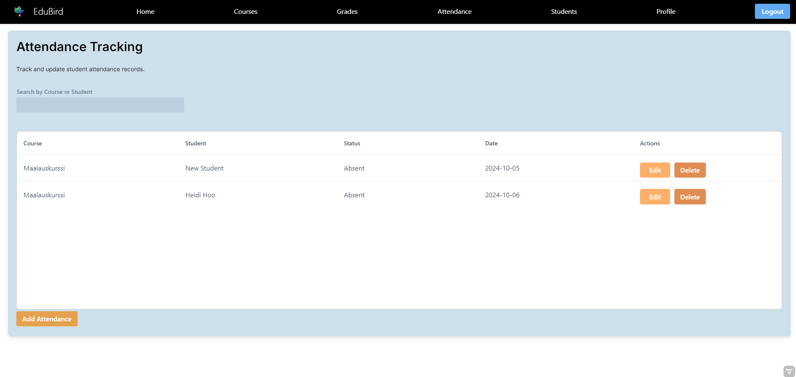
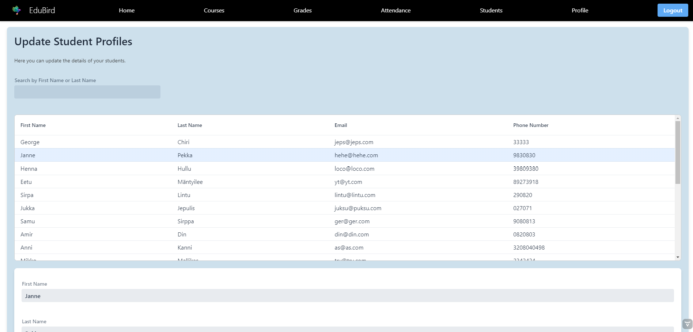

# Student Information System

## Project Overview
The Student Information System is a web application designed to facilitate interactions between students and teachers, manage course enrollments, track attendance, and handle grade management. It provides a comprehensive platform for educational institutions to efficiently manage their academic activities.

## Contents
- [Getting Started](#getting-started)
  - [Prerequisites](#prerequisites)
  - [Installation Instructions](#installation-instructions)
  - [Running the Application](#running-the-application)
- [Configuration Highlights](#configuration-highlights)
  - [Environment Configuration](#environment-configuration)
  - [Application Properties](#application-properties)
- [Dockerfile](#dockerfile)
- [Jenkins Pipeline](#jenkins-pipeline)
- [Database Schema](#database-schema)
- [ER Diagram](#er-diagram)
- [Application Walkthrough](#application-walkthrough)
  - [Login, Forgot Password, and Registration](#login-forgot-password-and-registration)
  - [Student Features](#student-features)
  - [Teacher Features](#teacher-features)
- [Technologies Used](#technologies-used)
- [Further Development Plan](#further-development-plan)
- [Contributing](#contributing)
- [Testing](#testing)
- [References](#references)
- [Authors](#authors)

## Getting Started

### Prerequisites
Ensure you have the following installed on your system:
- Java Development Kit (JDK) 21
- Maven
- MySQL
- Docker (optional for containerized deployment)

### Installation Instructions
1. **Clone the Repository**:
  - Open your terminal or command prompt.
  - Clone the repository to your local machine using Git.

2. **Navigate to the Project Directory**:
  - Use the `cd` command to change into the directory where the project files are located.

3. **Configure the Environment Variables**:
  - Create a `.env` file in the `src/main/resources` folder of the project.
  - Populate this file with your database and email settings:
    - Set the database username, password, and URL.
    - Set the email username and password, along with the SMTP host and port.

4. **Build the Project**:
  - Use Maven to clean and package the project by running a specific command that compiles the code and prepares it for deployment.

## Running the Application

### Option 1: Using Maven
- To run the application with Maven, execute a command that starts the Spring Boot application.

### Option 2: Using Docker
- If you prefer containerized deployment:
  - Build the Docker image using a command that specifies the current directory.
  - Run the Docker container, mapping the application port to your host machine.

## Configuration Highlights

### Environment Configuration
- Ensure the environment configuration file includes:
  - **Database Settings**: Credentials to connect to your MySQL database.
  - **Email Settings**: SMTP configuration details necessary for sending emails.

### Application Properties
- Key properties in your application settings should define:
  - The server port the application will listen on.
  - Database connection details using the previously defined environment variables.
  - Email service configuration for sending out emails, utilizing the environment variables set earlier.

### Dockerfile
- The project uses a multi-stage Dockerfile to build and run the application efficiently.

### Jenkins Pipeline
- The Jenkins pipeline automates code checkout, build, testing, and code coverage report generation.

## Database Schema
The Database Schema illustrates the structure of the database used in this application, including tables for Users, Courses, Grades, Attendance, and more, along with their relationships.

## ER Diagram
The ER Diagram provides a visual representation of the relationships between various entities in the system, showcasing how data is interconnected.

## Application Walkthrough

### Login, Forgot Password, and Registration
- **Login**: The main page where users can log in using their credentials.
  

- **Forgot Password**: Click the "Forgot Password?" link to receive a password reset link.
  

- **Register**: New users can create an account by filling out their details.
  

### Student Features
- **Dashboard**: Access various functionalities such as viewing courses and checking grades.
  

- **Courses**: View enrolled and available courses.
  

- **Edit Profile**: Update personal details.
  

- **Grades Overview**: View grades for all completed courses.
  

### Teacher Features
- **Dashboard**: Manage students, courses, attendance, and grading.
  

- **Attendance Tracking**: Manage student attendance records.
  

- **Course Management**: Add, edit, and delete courses.
  

- **Edit Profile**: Update teacher details.
  

- **Grades Management**: Manage student grades for specific courses.
  

- **Student Management**: View and update student profiles.
  

## Technologies Used
- Java 21
- Spring Boot 3.2.8
- Vaadin 24.4.10
- MySQL for production, H2 for testing
- Maven for dependency management
- Docker for containerization
- Jenkins for CI/CD
- JUnit and Mockito for testing
- Lombok for reducing boilerplate code
- SLF4J and Logback for logging

## Further Development Plan
- Introduce admin role for central management.
- Implement real-time communication features.
- Add comprehensive analytics and reporting tools.
- Integrate calendar and notification systems.
- Enable multi-language support.

## Testing
- Refer to the testing README for details on running unit and integration tests using JUnit and Mockito.

## References
- [Vaadin Documentation](https://vaadin.com/docs)
- [Spring Boot Reference](https://spring.io/projects/spring-boot)
- [MySQL Documentation](https://dev.mysql.com/doc/)

## Authors
- [Anni](https://github.com/annikannisto)
- [Eetu](https://github.com/eetuam1)
- [George](https://github.com/GeorgeChirikov)
- [Gitta](https://github.com/gitober)
