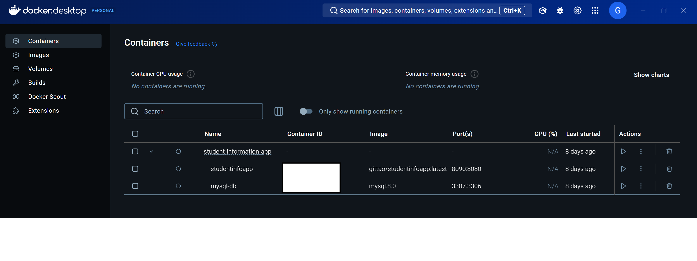

# Docker Documentation

## Contents
- [Introduction](#introduction)
- [Environment Variables](#environment-variables)
- [Dockerfile](#dockerfile)
- [Docker Compose](#docker-compose)
- [Using Docker Desktop](#using-docker-desktop)
- [Creating a Repository in Docker Hub](#creating-a-repository-in-docker-hub)
- [Testing and Troubleshooting](#testing-and-troubleshooting)

---

## Introduction

This documentation explains how to use Docker to containerize and manage the Student Information System project. It outlines the following:

1. **Building the Docker Image**: Step-by-step instructions for creating a Docker image of the project.
2. **Running Locally with Docker Desktop**: Testing and debugging the application in a local Docker environment.
3. **Pushing to Docker Hub**: Sharing the Docker image in a centralized repository.
4. **Automating Deployment with Jenkins**: Integrating Jenkins for building, testing, and deploying the application.

For detailed Jenkins setup and pipeline instructions, refer to the dedicated [Jenkins Documentation](../../testing/jenkins/jenkins-pipeline.md).

---

## Environment Variables
Environment variables are essential for managing sensitive information like database credentials. Create a `.env` file in the root of your project with the following content:

```env
# Database settings
DB_USERNAME=your_db_username
DB_PASSWORD=your_db_password
DB_URL=jdbc:mysql://host.docker.internal:3307/studentinfoapp
MYSQL_ROOT_PASSWORD=your_mysql_root_password
```

**Instructions:**
- Replace placeholders (`your_db_username`, etc.) with actual values.
- Add `.env` to `.gitignore` to prevent it from being committed.

<p align="right">(<a href="#docker-documentation">back to top</a>)</p>

---

## Dockerfile
The Dockerfile defines the steps for building your application container. It uses a multi-stage build for efficiency.

### Example Dockerfile
```Dockerfile
# Build Stage
FROM maven:3.9.4-eclipse-temurin-21 AS builder
WORKDIR /app
COPY pom.xml .
RUN mvn dependency:go-offline
COPY src /app/src
RUN mvn clean package vaadin:build-frontend -Pproduction -DskipTests

# Run Stage
FROM eclipse-temurin:21-jre
LABEL authors="your_name"
RUN groupadd -r appuser && useradd --no-log-init -r -g appuser appuser
COPY --from=builder /app/target/student-information-app-1.0-SNAPSHOT.jar /app.jar
RUN chown appuser:appuser /app.jar
USER appuser
EXPOSE 8090
ENTRYPOINT ["java", "-jar", "/app.jar"]
```
**Steps:**
1. Save the file as `Dockerfile` in your project root.
2. Build the image locally:
   ```sh
   docker build -t student-information-app .
   ```
3. Run the container:
   ```sh
   docker run -p 8090:8090 student-information-app
   ```

<p align="right">(<a href="#docker-documentation">back to top</a>)</p>

---

## Docker Compose
Docker Compose simplifies running multiple services, like the application and database, together.

### Example `docker-compose.yml`
```yaml
version: '3.8'

services:
  mysql:
    image: mysql:8.0
    container_name: mysql_container
    environment:
      MYSQL_ROOT_PASSWORD: ${MYSQL_ROOT_PASSWORD}
      MYSQL_DATABASE: studentinfoapp
    ports:
      - "3307:3306"
    volumes:
      - mysql-data:/var/lib/mysql
    networks:
      - app-network

  studentinfoapp:
    image: your_username/studentinfoapp:latest
    container_name: app_container
    build:
      context: .
    environment:
      - DB_URL=${DB_URL}
      - DB_USERNAME=${DB_USERNAME}
      - DB_PASSWORD=${DB_PASSWORD}
      - EMAIL_USERNAME=${EMAIL_USERNAME}
      - EMAIL_PASSWORD=${EMAIL_PASSWORD}
      - SMTP_HOST=${SMTP_HOST}
      - SMTP_PORT=${SMTP_PORT}
    ports:
      - "8090:8080"
    depends_on:
      - mysql
    networks:
      - app-network

volumes:
  mysql-data:

networks:
  app-network:
    driver: bridge
```
**Steps:**
1. Save the file as `docker-compose.yml`.
2. Start all services:
   ```sh
   docker-compose up --build
   ```
3. Stop services:
   ```sh
   docker-compose down
   ```

<p align="right">(<a href="#docker-documentation">back to top</a>)</p>

---

## Using Docker Desktop
Docker Desktop is a user-friendly way to test images locally.

**Build Image:**
- Open Docker Desktop.
- Go to Images > Build Image.
- Select your Dockerfile and context.

**Run Container:**
- Find your built image in the Images tab.
- Click Run.
- Map ports:
    - Host: 8090
    - Container: 8080
- Click Run.

**Test:**
- Open [http://localhost:8090](http://localhost:8090).

<p align="right">(<a href="#docker-documentation">back to top</a>)</p>

---

## Creating a Repository in Docker Hub
To share your images, create a repository in Docker Hub.

**Steps:**
1. Log in to Docker Hub.
2. Click "Create Repository".
3. Enter a name (e.g., `studentinfoapp`).
4. Set visibility (Public/Private).
5. Click Create.

**Push Image to Repository:**
1. Tag the image:
   ```sh
   docker tag student-information-app your_username/studentinfoapp:latest
   ```
2. Push the image:
   ```sh
   docker push your_username/studentinfoapp:latest
   ```

<p align="right">(<a href="#docker-documentation">back to top</a>)</p>

---

## Testing and Troubleshooting
**Common Commands:**
- View logs:
  ```sh
  docker logs app_container
  ```
- Monitor resources:
  ```sh
  docker stats
  ```
- Check running containers:
  ```sh
  docker ps
  ```

---

**Common Issues:**
- **Port Conflicts**: Ensure ports (8090, 3307) are free.
- **Environment Variables**: Check `.env` configuration.
- **Build Failures**: Verify Dockerfile and dependencies.

<p align="right">(<a href="#docker-documentation">back to top</a>)</p>

---



---

[Back to Project Overview](../../project-overview.md)


