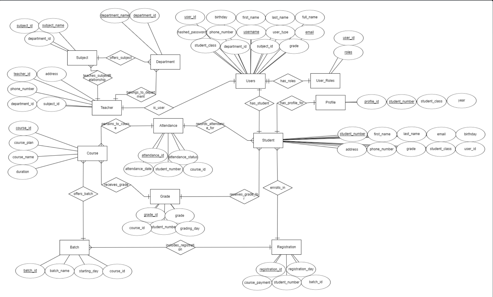
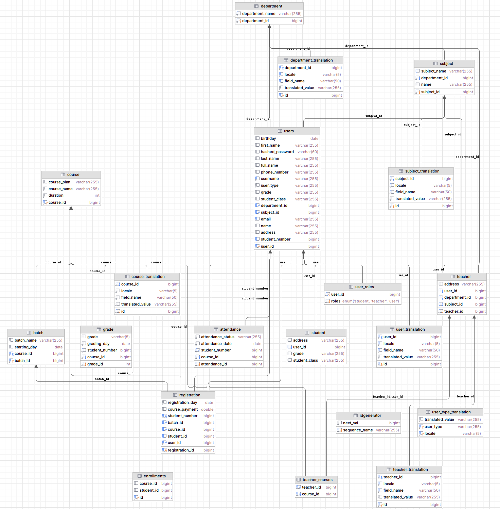
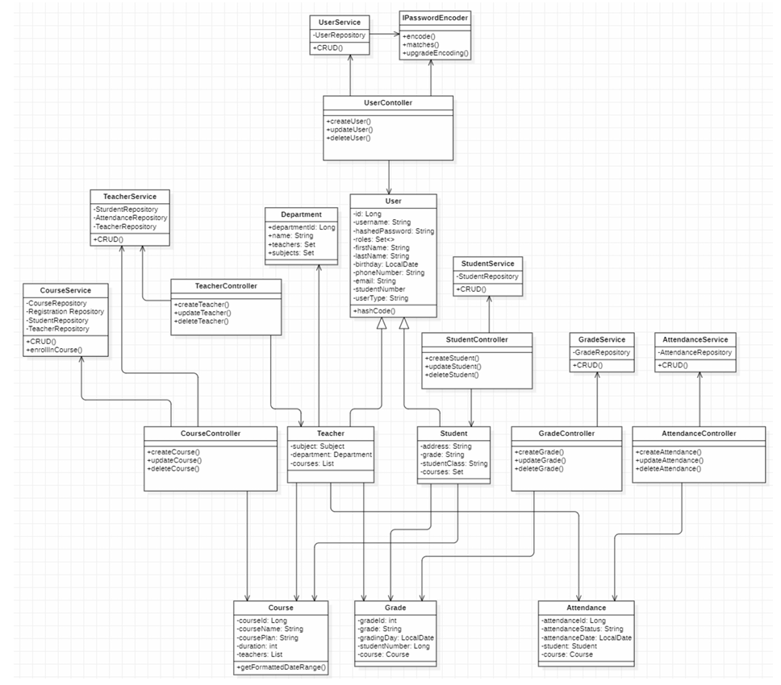
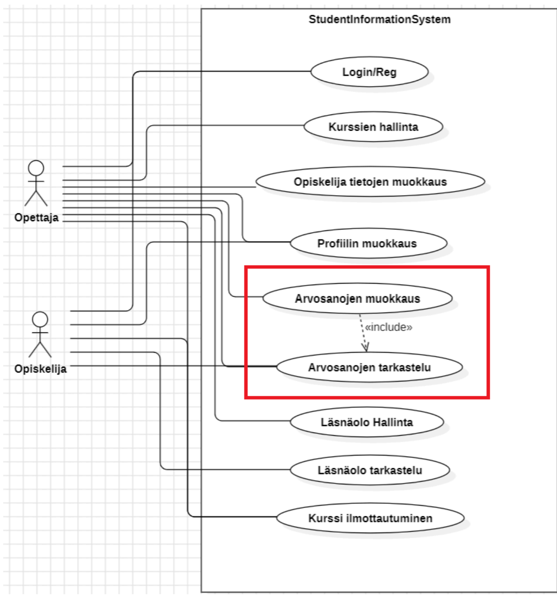
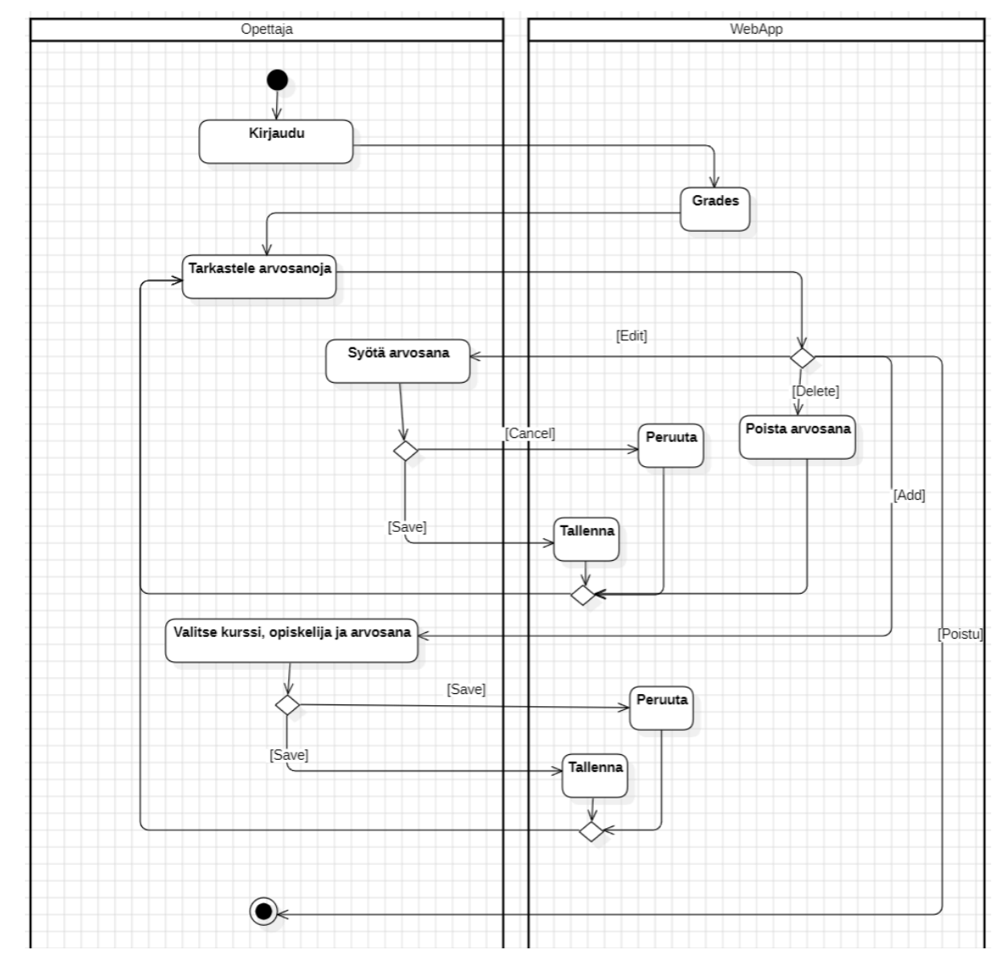
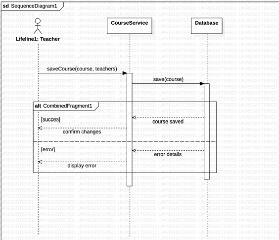

# Project Diagrams Overview

This document provides an overview of various diagrams that describe the architecture, structure, and processes within the project. Each diagram serves a different purpose in representing aspects of the **Student Information System**.

---

## 1. Entity Relationship (ER) Diagram

The **ER Diagram** represents the entities in the project and their relationships. It showcases the data model and how different tables such as **Student**, **Teacher**, **Course**, and **Department** are connected.

> **Note**: The diagram does not include the later-added translation tables, which were introduced to support multiple languages in the application.

---

## 2. Relational Database Diagram

The **Relational Database Diagram** shows the structure of the database, including the tables, columns, and relationships between them. It provides insight into how data is stored and linked, ensuring data consistency across different modules.

---

## 3. Class Diagram

The **Class Diagram** represents the system's static structure by showing the classes, their attributes, and methods, along with the relationships between them. This diagram is crucial for understanding the project's object-oriented structure and interactions between different classes.

---

## 4. Use Case Diagram for Grades

The **Use Case Diagram for Grades** illustrates an example of how teachers and students interact with the system to manage grades.

**Actors:**
- **Teacher** ("Opettaja")
- **Student** ("Opiskelija")

**Use Cases:**

1. **Edit Student Information** ("Opiskelija tietojen muokkaus")
    - The **teacher** can view and edit student information.

2. **Edit Profile** ("Profiilin muokkaus")
    - Both **teachers** and **students** can view and edit their own profile information.

3. **Edit Grades** ("Arvosanojen muokkaus")
    - The **teacher** can view and edit students' grades.

4. **View Grades** ("Arvosanojen tarkastelu")
    - **Students** can view their grades but do not have permission to modify them.

5. **Attendance Management** ("Läsnäolo hallinta")
    - The **teacher** can manage student attendance information.

6. **Course Enrollment** ("Kurssi ilmoittautuminen")
    - The **teacher** can enroll students in courses.
    - **Students** can also enroll themselves in courses.

This diagram serves as an example use-case diagram for grades, showcasing how different users, specifically teachers and students, interact with the grade-related features of the **Student Information System**.

---

## 5. Activity Diagram for Grades

The **Activity Diagram for Grades** illustrates the workflow for managing grades, including the steps a teacher takes to add, edit, or delete student grades.

1. The teacher logs in and navigates to the "Grades" section in the navigation bar.
2. The teacher can choose to add, edit, or delete grades.
3. **Add**: To add a new grade, the teacher selects a course, a student, and inputs the grade.
4. **Edit**: To modify a grade, the teacher selects an existing grade and updates it.
5. **Delete**: The teacher can delete an existing grade.
6. The teacher must click **Save** to confirm changes or **Cancel** to discard them.
7. The teacher can exit at any point during the process.

---

## 6. Sequence Diagram for Course

The **Sequence Diagram for Course** illustrates the interaction between different objects during the course management process. The diagram demonstrates the following sequence:

1. The teacher initiates the process to save a course.
2. The **CourseService** handles the save operation and communicates with the **Database** to store the course information.
3. If the save operation is successful, a confirmation message is sent back to the teacher to confirm changes.
4. If there is an error during the save operation, an error message is returned, and the teacher is informed about the issue.

---

These diagrams are integral to understanding the system's architecture, data flow, and user interactions. Each diagram provides a unique perspective, offering insights into the design and functional aspects of the **Student Information System**.
