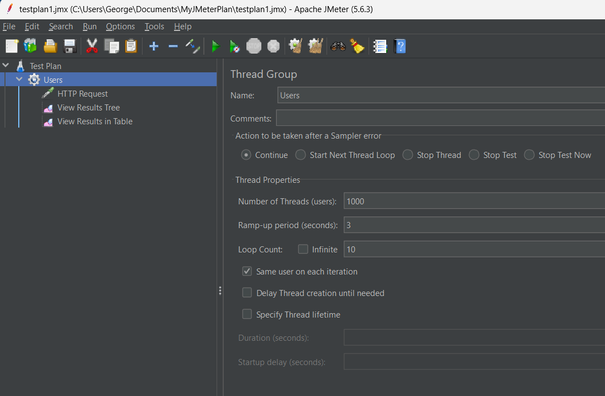
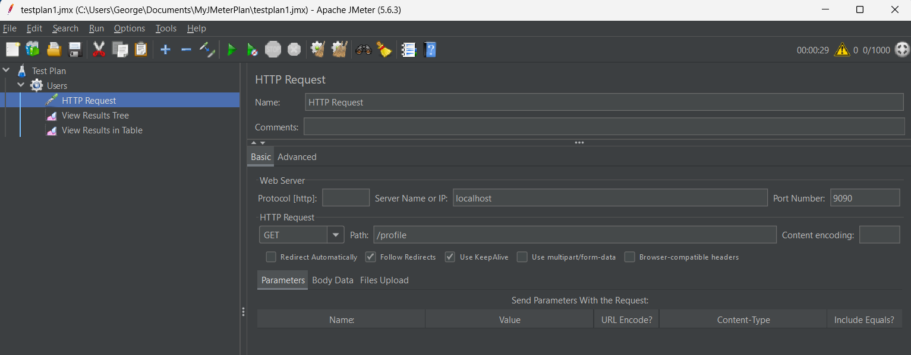
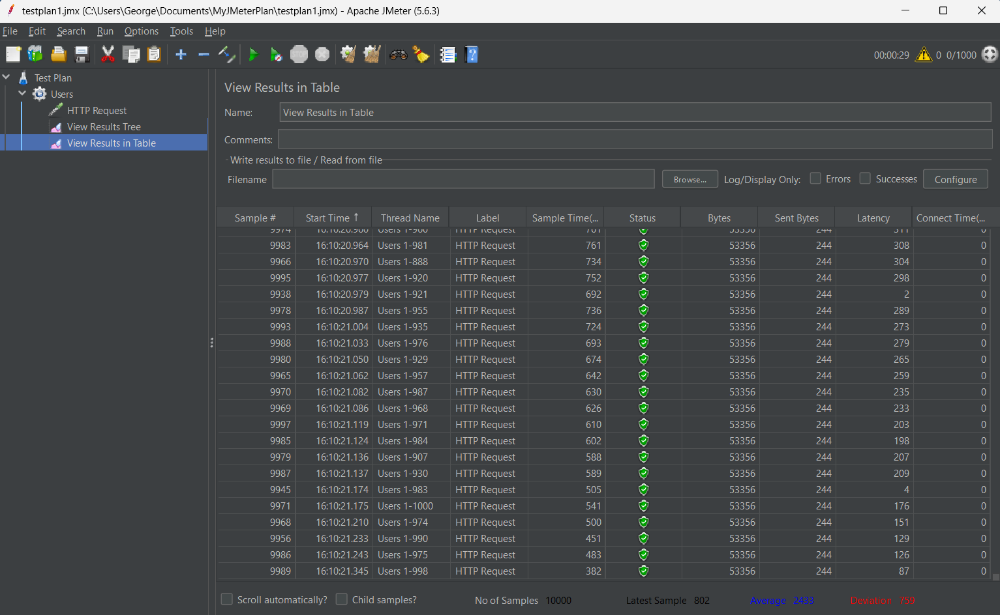

# Performance Test Report

## Contents

- [Introduction](#introduction)
- [Test Methodology](#test-methodology)
- [Results](#results)
- [Anomaly](#anomaly)
- [Conclusion](#conclusion)
- [Implementation](#implementation)

---

**Project:** Student Information System

**Scope:** Landing Page (/profile)

**Protocol:** HTTP Request (GET Operation)

**Tool Used:** Apache JMeter

## Introduction
The purpose of this performance test was to evaluate the system's ability to handle a large number of concurrent users without significant performance degradation.

---

## Test Methodology
The test was conducted using the Apache JMeter tool, utilizing the HTTP protocol with GET requests.

**Load Test Parameters:**
- **Number of Threads (Users):** 1000
- **Ramp-Up Period:** 3 seconds
- **Loop Count:** 10

---

## Results
- **Test Duration:** 33 seconds
- **Request status:** 100% success rate
- **Median Latency:** 1253 ms
- **Bytes sent per request:** 244 bytes

---

## Anomaly
During the first run of the test, the initial 500 out of 10,000 requests failed randomly.

---

## Conclusion
The system successfully passes the load test and can be considered ready for production deployment. However, as the number of users increases over time, it is advisable to upgrade the hardware to enhance performance.

---

## Implementation
- Create Thread Group (Right-click on Test Plan > Add > Threads (Users) > Thread Group)
    - Name it meaningfully (e.g., `Users`)
    - Set the number of threads (users) (e.g., `1000`)
    - Define the ramp-up period (e.g., `3 seconds`)
    - Set the loop count (e.g., `10`)
- Configure the HTTP Request (Right-click on Thread Group > Add > Sampler > HTTP Request)
    - Name it meaningfully (e.g., `GET /profile`)
    - Define protocol (e.g., `http`)
    - Set the server name or IP address (e.g., `localhost`), this does not include `http://` or any path
    - Define the port number (e.g., `8080`)
    - Set the request method (e.g., `GET`)
    - Define the path (e.g., `/profile` which will be appended to the server name)
- Save the test plan and run the test
    - Save the test plan (File > Save Test Plan As...) so that you can run it later
    - Before running the test, ensure the server is running and the endpoint is accessible
    - Run the test (Run > Start or Ctrl+R) or click the green play button

---

