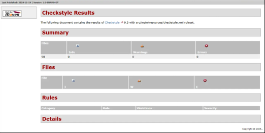

# Checkstyle Report

---

## Summary
Checkstyle analyzes your code's compliance with style guidelines using a custom configuration and Maven project. The results confirm that the project's code fully adheres to the defined rules, supporting code quality and consistency.

---

## Configuration and Process

### 1. Build and Checkstyle Workflow
The following steps were defined in the GitHub Actions workflow file:

- **Code checkout**: `actions/checkout@v3`
- **JDK setup**: JDK 22
- **Dependency installation**: `mvn install`
- **Checkstyle execution**: `mvn checkstyle:check`

This pipeline ensures Checkstyle is executed on every change to the `main` branch and during pull requests.

### 2. Checkstyle Configuration (`checkstyle.xml`)
- **Line Length**: Maximum 120 characters.
- **JavaDoc Checks**: Enabled to enforce documentation standards.
- **Suppressions**:
    - All checks in the `src/test` directory are excluded.
    - Line length checks are globally suppressed.

### 3. Maven Checkstyle Plugin (`pom.xml`)
- **Configuration location**: `src/main/resources/checkstyle.xml`
- **Target directories**: `src/main/java`
- **Console output**: Enabled (`true`)
- **Fail on errors**: Enabled (`failsOnError: true`)

---

## Analysis Results

### Analyzed Files:
- **Total files**: 98
- **Errors**: 0
- **Warnings**: 0



### Details:
The analysis confirmed no violations of the defined Checkstyle rules in the project files. Suppressions were effectively configured to avoid irrelevant warnings.

---

## Conclusion
The Checkstyle results confirm that the project's code fully complies with the defined style rules. This ensures clarity, consistency, and maintainability.

### Recommendations:
- Expand Checkstyle rules iteratively to include more detailed quality checks.
- Review and limit suppressions to maximize rule coverage.

Checkstyle integration serves as a strong foundation for ensuring code quality as part of continuous integration and delivery.

---

## Implementation Steps

### 1. Add Checkstyle Plugin to the Project
Using Maven, the Checkstyle plugin was integrated by adding the following configuration to `pom.xml`:

```xml
<plugin>
    <groupId>org.apache.maven.plugins</groupId>
    <artifactId>maven-checkstyle-plugin</artifactId>
    <version>3.1.2</version>
    <configuration>
        <configLocation>src/main/resources/checkstyle.xml</configLocation>
        <consoleOutput>true</consoleOutput>
        <failsOnError>true</failsOnError>
    </configuration>
</plugin>


```
This configuration enables automatic Checkstyle execution as part of the Maven build process.

---

## Configuration Steps

### 1. Define Rules (`checkstyle.xml`)
Rules for code checks were defined in `src/main/resources/checkstyle.xml`, including:

- **Maximum line length**: 120 characters.  
- **JavaDoc checks**: Enforce consistent documentation.  
- **Suppressions**: Configured in a separate file (`checkstyle-suppressions.xml`) to avoid unnecessary warnings for test code and line length checks.

### 2. Configure Suppressions
Suppressions were configured in `checkstyle-suppressions.xml` to exclude certain checks:

- **Test Code**: All files in the `src/test` directory are ignored.  
- **Line Length**: Line length checks are suppressed globally.

### 3. GitHub Actions Integration
Checkstyle is automatically executed as part of the CI pipeline in GitHub Actions using the following configuration in `build.yml`:

```yaml
name: Build and Checkstyle

on:
  push:
    branches:
      - main
  pull_request:

jobs:
  build:
    runs-on: ubuntu-latest
    steps:
      - name: Checkout code
        uses: actions/checkout@v3
      - name: Setup JDK 22
        uses: actions/setup-java@v3
        with:
          java-version: 22
      - name: Install dependencies
        run: mvn install
      - name: Run Checkstyle
        run: mvn checkstyle:check

```
4. Console Output and Logs
   Checkstyle results can be reviewed directly from the console logs (stdout) or by generating an HTML report. The configuration consoleOutput: true ensures clear output during the CI process.

### Benefits of Integration
1. Automatic Validation
   Checkstyle runs on every code change in the GitHub Actions pipeline, ensuring continuous compliance with rules.

2. Consistency
   Enforces coding standards, aiding collaboration in larger teams.

3. Customizability
   Rules can be tailored, and suppressions focus on key areas.

4. Fail-Fast Mechanism
   The failsOnError: true configuration ensures the build fails if style violations are detected.

Conclusion
The Checkstyle integration was successfully implemented and is now part of the project's continuous integration pipeline. It ensures adherence to style rules and improves long-term code quality.

This configuration is easily extendable by adding new rules and checks as the project evolves.