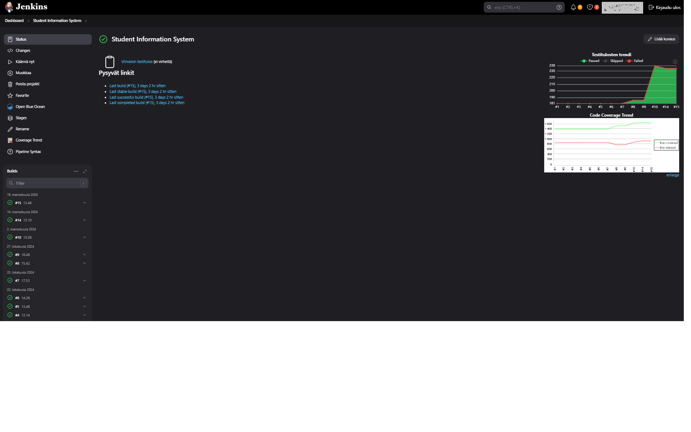

# Jenkins Pipeline Documentation

## Contents
- [Summary](#summary)
- [Pipeline Definition](#pipeline-definition)
- [Placeholders Explained](#placeholders-explained)
- [Setting Up Jenkins](#setting-up-jenkins)
- [Additional Resources](#additional-resources)

---

## Summary
This Jenkins pipeline automates the build, test, code coverage, Docker image creation, and deployment to Docker Hub. It simplifies the development and deployment process for projects like the Student Information System.

---

## Pipeline Definition
```groovy
pipeline {
    agent any
    tools {
        maven 'Maven3'  // Ensure Maven is installed
        jdk 'Java_Home'  // Ensure JDK is installed
    }
    environment {
        DOCKERHUB_CREDENTIALS_ID = 'your_dockerhub_credentials'  // Docker Hub credentials ID in Jenkins
        DOCKERHUB_REPO = 'your_repository/your_project'          // Docker Hub repository name
        DOCKER_IMAGE_TAG = 'latest'                              // Docker image tag
    }
    stages {
        stage('Checkout Code') {
            steps {
                git credentialsId: 'your_git_credentials', url: 'https://github.com/your_username/your_repository.git', branch: 'main'
            }
        }
        stage('Build and Test') {
            steps {
                dir('your_project_directory') {  // Replace with your project directory
                    sh 'mvn clean package'
                    sh 'mvn test'
                }
            }
            post {
                always {
                    dir('your_project_directory') {  // Replace with your project directory
                        junit 'target/surefire-reports/*.xml'  // Test reports
                    }
                }
            }
        }
        stage('Code Coverage and Report') {
            steps {
                dir('your_project_directory') {  // Replace with your project directory
                    sh 'mvn jacoco:report'
                }
            }
            post {
                always {
                    dir('your_project_directory') {  // Replace with your project directory
                        jacoco(execPattern: 'target/jacoco.exec')  // Code coverage report
                    }
                }
            }
        }
        stage('Build and Push Docker Image') {
            steps {
                dir('your_project_directory') {  // Replace with your project directory
                    script {
                        docker.build("${DOCKERHUB_REPO}:${DOCKER_IMAGE_TAG}")
                        withCredentials([usernamePassword(credentialsId: DOCKERHUB_CREDENTIALS_ID, usernameVariable: 'DOCKER_USERNAME', passwordVariable: 'DOCKER_PASSWORD')]) {
                            sh 'echo $DOCKER_PASSWORD | docker login -u $DOCKER_USERNAME --password-stdin'
                        }
                        docker.image("${DOCKERHUB_REPO}:${DOCKER_IMAGE_TAG}").push()
                    }
                }
            }
        }
    }
    post {
        always {
            cleanWs()  // Clean workspace after build
        }
    }
}
```
<p align="right">(<a href="#contents">back to top</a>)</p>

---

## Placeholders Explained
Replace these placeholders with your actual details:
- `your_dockerhub_credentials`: Your Docker Hub credentials ID configured in Jenkins.
- `your_repository/your_project`: Your Docker Hub repository name, e.g., `username/project-name`.
- `your_git_credentials`: Your Git credentials ID in Jenkins.
- `your_username/your_repository.git`: Your GitHub username and repository URL.
- `your_project_directory`: The directory name of your project (e.g., `student-information-app`).

<p align="right">(<a href="#contents">back to top</a>)</p>

---

## Setting Up Jenkins
### Steps to Configure Jenkins:
1. **Install Required Plugins**:
    - **Git Plugin**: For Git repository integration.
    - **Jacoco Plugin**: For code coverage reports.
    - **Pipeline Maven Integration**: For Maven support.
    - **Docker Pipeline Plugin**: For Docker operations.

2. **Add Tools**:
    - Go to **Manage Jenkins > Global Tool Configuration**.
    - Add:
        - **JDK**: Configure `Java_Home` for your Java installation.
        - **Maven**: Configure `Maven3` for your Maven installation.

3. **Add Credentials**:
    - Navigate to **Manage Jenkins > Credentials > System > Global Credentials**.
    - Add:
        - **Git credentials**: For accessing your Git repository.
        - **Docker Hub credentials**: For pushing images to Docker Hub.

4. **Create a New Pipeline Job**:
    - Go to **New Item > Pipeline**.
    - Name your job and select "Pipeline".
    - Paste the pipeline script into the **Pipeline Script** section.

5. **Run the Job**:
    - Trigger the job manually or set up a schedule/trigger for automated builds.

<p align="right">(<a href="#contents">back to top</a>)</p>

---

## Additional Resources
- [Jenkins Official Documentation](https://www.jenkins.io/doc/)
- [Docker Pipeline Plugin](https://plugins.jenkins.io/docker-workflow/)
- [Jacoco Maven Plugin](https://www.eclemma.org/jacoco/)

<p align="right">(<a href="#contents">back to top</a>)</p>




---

[Back to Testing Overview](../testing-overview.md)
