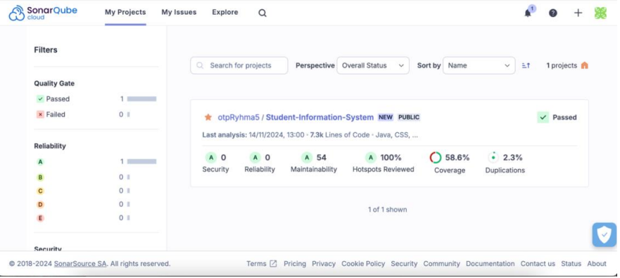

# SonarCloud Documentation

## Contents
- [Summary](#summary)
- [Implementation Steps](#implementation-steps)
   - [Maven Plugin Configuration (`pom.xml`)](#1-maven-plugin-configuration-pomxml)
   - [SonarCloud GitHub Actions Workflow](#2-sonarcloud-github-actions-workflow)
   - [SonarCloud Project Configuration (`sonar-project.properties`)](#3-sonarcloud-project-configuration-sonar-projectproperties)
- [Analysis Results](#analysis-results)

---

## Summary
SonarCloud has been integrated into the project's code quality management process to provide analytics on code quality, security, and test coverage. This report outlines the steps for SonarCloud implementation, pipeline configuration, and key results.

---

## Implementation Steps

### 1. Maven Plugin Configuration (`pom.xml`)
SonarCloud was integrated using the **Sonar Maven Plugin**, enabling analysis as part of the Maven build process. Key configurations include:

- **Organization and URL**:
```yaml
<properties>
<sonar.organization></sonar.organization>
<sonar.host.url>https://sonarcloud.io</sonar.host.url>
<sonar.exclusions>**/*.ts,**/*.js,**/*.tsx,**/*.mjs,**/vaadin/**,**/node_modules/**,**/generated/**,**/target/**,**/src/test/**</sonar.exclusions>
</properties>
```
- Defines which files are analyzed and which are excluded.
- **Sonar Maven Plugin**:
```yaml
<plugin>
   <groupId>org.sonarsource.scanner.maven</groupId>
   <artifactId>sonar-maven-plugin</artifactId>
   <version>3.9.1.2184</version>
   <executions>
      <execution>
          <goals>
              <goal>sonar</goal>
          </goals>
      </execution>
   </executions>
</plugin>
```
This plugin enables SonarCloud analysis through the command `mvn sonar:sonar`.


### 2. SonarCloud GitHub Actions Workflow
The workflow configuration enables automatic analysis whenever code is pushed to the `main` branch or a pull request is created.

- **Workflow Configuration (`workflow/sonarcloud.yml`)**:

```yaml
name: SonarCloud Analysis

on:
   push:
      branches:
         - main
   pull_request:
      types: [opened, synchronize, reopened]
   workflow_dispatch:  

permissions:
   pull-requests: read

jobs:
   sonarcloud:
      name: SonarCloud Analysis
      runs-on: ubuntu-latest

      steps:
         - uses: actions/checkout@v4
           with:
              fetch-depth: 0

         - name: Set up JDK 22
           uses: actions/setup-java@v4
           with:
              java-version: 22
              distribution: 'zulu'

         - name: Build Project with Maven
           run: mvn clean install
           working-directory: student-information-app  

         - name: SonarCloud Scan
           uses: SonarSource/sonarcloud-github-action@master
           env:
              GITHUB_TOKEN: ${{ secrets.GIT_TOKEN }}
              SONAR_TOKEN: ${{ secrets.SONAR_TOKEN }}
           with:
              args: >
                 -Dsonar.projectKey=
                 -Dsonar.organization=
                 -Dsonar.sources=student-information-app/src
                 -Dsonar.java.binaries=student-information-app/target
                 -Dsonar.exclusions=**/*.ts,**/*.js,**/*.tsx,**/*.mjs,**/vaadin/**,**/node_modules/**,**/generated/**,**/target/**,**/src/test/**
                 -Dsonar.coverage.jacoco.xmlReportPaths=student-information-app/target/site/jacoco/jacoco.xml

```
The workflow performs the following steps:

- **Code Checkout**: Downloads the project code.
- **JDK 22 Setup**: Uses the Zulu distribution.
- **Maven Build**: Runs `mvn clean install` to build the project before analysis.
- **SonarCloud Analysis**: Utilizes encrypted tokens `SONAR_TOKEN` and `GITHUB_TOKEN` for authentication.


### 3. SonarCloud Project Configuration (`sonar-project.properties`)
This file contains project-specific settings, such as the source code location and analysis exclusions.
```yaml
sonar.projectKey=
sonar.organization=
sonar.host.url=https://sonarcloud.io

# Exclude vaadin, node_modules, generated, and target directories from analysis
sonar.exclusions=**/*.ts,**/*.js,**/*.tsx,**/*.mjs,**/vaadin/**,**/node_modules/**,**/generated/**,**/target/**,**/src/test/**

# Specify where the main sources are
sonar.sources=src

# Java version to analyze
sonar.java.source=22
```

<p align="right">(<a href="#contents">back to top</a>)</p>

---

## Analysis Results
SonarCloud provides detailed reports on code quality. Key metrics include:

1. **Code Quality Rating**
   - Code Smells: 0
   - Bugs: 0
   - Vulnerabilities: 0
   - Duplicated Code: 2.4%
2. **Test Coverage**
   - Reported through `jacoco.xml`, current coverage: 58.6%.
3. **Cyclomatic Complexity**
   - Some methods exceed the recommended complexity threshold based on measurements.
4. **Security Hotspots**
   - All critical issues have been reviewed.



<p align="right">(<a href="#contents">back to top</a>)</p>

---

[Back to Testing Overview](../testing-overview.md)


