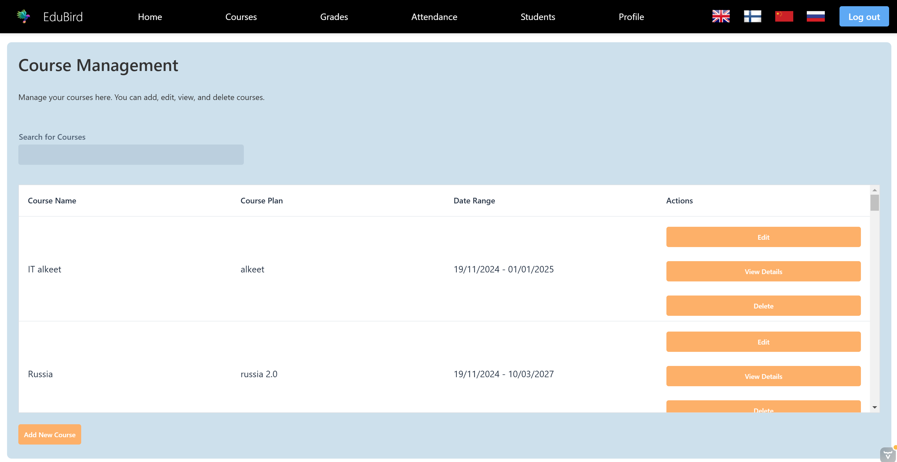

## Application Walkthrough

The application provides various features for both students and teachers, allowing them to manage profiles, courses, grades, and attendance. The application supports multiple languages, including **English**, **Finnish**, **Russian**, and **Chinese**.

## Contents
- [Login, Forgot Password, and Registration](#login-forgot-password-and-registration)
- [Teacher Features](#teacher-features)
- [Student Features](#student-features)

---

### Login, Forgot Password, and Registration
- **Login:** This is the main page where users can log in using their credentials. Enter your email and password, and click "Sign in" to access your dashboard.

  

- **Register:** New users can create an account by filling out their details, such as name, email, phone number, and role (student or teacher). Click "Register" to complete the registration process.

  

- **Forgot Password:** If you forget your password, click the "Forgot Password?" link on the login page. Enter your registered email to receive a password reset link.

  

(<a href="#contents">back to top</a>)

---

### Teacher Features
- **Dashboard:** The teacher's main interface for managing students, courses, attendance, and grading. It provides quick access to all essential functions.

  

- **Course Management:** Teachers can add, edit, and delete courses. Use the "Add Course" button to create new courses or "Edit" to modify existing ones.

  

- **Grades Management:** Manage student grades for specific courses. Use the "Edit" button to update a student's grade or "Add Grade" to enter a new one.

  

- **Attendance Tracking:** Allows teachers to manage student attendance records. Search by course or student to update attendance status.

  

- **Student Management:** View and update student profiles. Use the search feature to find students by first or last name.

  

- **Edit Profile:** Update teacher details such as name, email, department, and subject. Click "Save" to save changes.

  

(<a href="#contents">back to top</a>)

---

### Student Features
- **Dashboard:** This is the student's main interface, providing access to various functionalities such as viewing courses, checking grades, and editing profiles.

  

- **Courses:** View enrolled courses and available courses. Use the "Enroll" button to register for a course or "View Attendance" to check attendance records.

  

- **Grades Overview:** View grades for all completed courses. This page displays the course name, grade, and the date the grade was assigned.

  

- **Edit Profile:** Update personal details such as name, email, and phone number. Click "Save" to apply the changes.

  

(<a href="#contents">back to top</a>)

---

[Back to Project Overview](../project-overview/project-overview.md)
